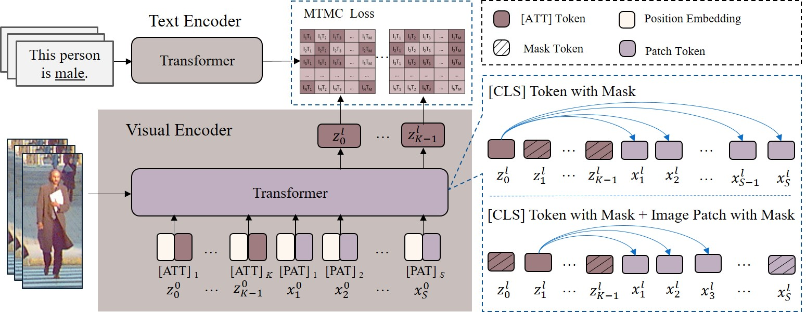

# POAR
our paper [POAR: Towards Open Vocabulary Pedestrian Attribute Recognition](https://arxiv.org/abs/2303.14643)

# train-TEMS📎

A PyTorch Lightning solution to train pedestrian open attribute recognition models

## Dependencies
```bash
pip install 'git+https://github.com/katsura-jp/pytorch-cosine-annealing-with-warmup'
pip install pytorch-lightning
```
 
## Usage 🚂

### Finetuning 🚆

```
python train_finetune.py --folder data_dir --batch_size 512
```
 
### Testing 🚆

```
CUDA_VISIBLE_DEVICES=0 python test_UDA_T2I.py --testset PA100K --trainset PETA --folder  ./test/dataset/PETA/
```

### Training with our DataModule 📉

As long as each of the image pairs have the same stem name (i.e. `img1.png` and `img1.txt`) all that you need to do is specify the folder on runtime. Any subfolder structure will be ignored, meaning `foo/bar/image1.jpg` will always find its `myster/folder/image1.txt` so long as they share a common parent folder. All image suffixes will work, the only expectation is that captions are separated by `\n`.


## Goal ⚽

Our aim is to create an easy to use Lightning implementation of pedestrian open attribute recognition. We will live by:

<p align="center">
    
</p>

## Citing
@inproceedings{Yue2023poar,
  title={POAR: Towards Open Vocabulary Pedestrian Attribute Recognition},
  author={Yue Zhang, Suchen Wang, Shichao Kan, Zhenyu Weng, Yigang Cen, and Yappeng Tan},
  booktitle={In Proceedings of the 31st ACM International Conference on Multimedia (MM ’23), October 29–November 3, Ottawa, ON, Canada.},
  year={2023},
  doi={10.1145/3581783.3611719}
}

## TODO ✅

- [x] Get OpenAI's model creation script
- [x] Create model inits
  - [x] ResNet50
  - [x] ResNet50x4
  - [x] ResNet101
  - [x] ViT-B/32
  - [x] all models
- [x] Create model wrapper
- [x] Create lightning trainer
- [x] Create dataset files 
- [ ] Performance boosts
  - [x] Mixed-precision
  - [x] Self-distillation
  - [ ] Gradient checkpointing
  - [ ] Half-precision Adam statistics
  - [ ] Half-precision stochastically rounded text encoder weights
